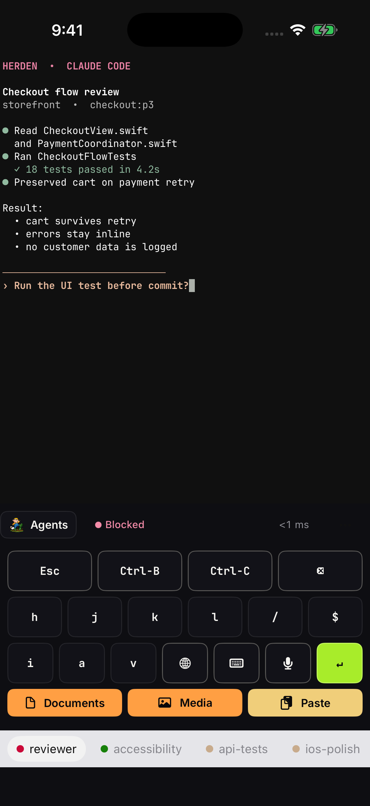

<div align="center">


# Herden

**A terminal-first iOS companion for [herdr](https://herdr.dev), maintained by [3LOC](https://github.com/3loc).**

[](https://github.com/3loc/herden/actions/workflows/ci.yml)
[](LICENSE)
[](https://github.com/ZingerLittleBee/Heeler)
[](https://www.swift.org)
[](https://developer.apple.com/ios/)
[](https://testflight.apple.com/join/aXSxRn4r)

Forked from Heeler with its complete history. Herden deliberately keeps the
upstream Xcode target and source names internally so upstream changes remain
easy to merge.

</div>

---

Herden is an **agent console**: a native dashboard of every coding agent running
on your machines, sorted by who needs you. Open an Agent to read and steer its
live terminal directly over SSH. There is no second input window: the compact
control deck, iOS keyboard, and on-device dictation all write to the real PTY.

Dictation can revise partial text but cannot submit it—every line break is
removed before bytes reach the terminal. Tap along the active prompt line, or
use the iOS keyboard's space-bar trackpad, to move the real TTY cursor and fix
recognition errors with your fingers.

## Screenshots

| Agent Console | Live terminal | Terminal controls |
| --- | --- | --- |
|  |  |  |

| Terminal | Skills | Live Activity |
| --- | --- | --- |
|  |  |  |

## Features

- **Console** — every Agent on every machine in one status-sorted list
  (Blocked first), filterable by Host, updated live.
- **Attach** — the Agent's real terminal rendered by libghostty: native
  scrollback, momentum touch scrolling that also drives full-screen TUIs,
  long-press selection, takeover of a stale terminal owner, and quietly
  collected web links to open later.
- **Direct terminal input** — an always-visible deck with Esc, Ctrl-B, Ctrl-C,
  vi movement keys, keyboard toggle, dedicated on-device dictation, and Return.
- **Touch correction** — tap the prompt or use the iOS keyboard trackpad to
  reposition the actual PTY cursor; no separate draft or input box.
- **Terminal** — open a plain shell in the Agent's directory, with Text and
  Keys modes and one reused tab per Workspace.
- **Attachments** — stage a photo or a file up to 64 MiB onto the Host over
  SFTP and insert its path into the draft.
- **QR pairing** — scan a Pairing Code to add a machine; keys are generated
  on device, private keys stay in the Keychain, and the code pins the host
  key fingerprint.
- **Notifications + Live Activities** — end-to-end encrypted pushes when an
  Agent goes Blocked or Done, and a lock-screen / Dynamic Island banner
  tracking Agents in real time; the relay can never read the content
  ([PRIVACY.md](PRIVACY.md)).
- **Worktrees** — start an Agent on a clean checkout of the workspace's repo.
- **Appearance** — System, Light, or Dark; 30 terminal themes with separate
  Light and Dark slots; bundled JetBrains Mono and IBM Plex Mono; pinch to
  zoom.
- **Jump Host** — reach unroutable machines through an SSH jump, with keys
  verified at both hops.

## How it connects

Herden speaks herdr's JSON API over SSH: each request opens a
direct-streamlocal channel onto `herdr.sock`, one long-lived channel carries
the event stream, and interactive terminals run `herdr agent attach
--takeover` on an SSH PTY. The only prerequisites are SSH access and a
running herdr — no server changes, no extra packages. The SSH server must
allow stream-local forwarding (the OpenSSH default); onboarding calls it out
when it's disabled.

Unroutable machines can sit behind an SSH Jump Host:

- [Set up remote access step by step](docs/guides/vps-jump-host-setup.md)
- [Architecture, security boundaries, and the VPS runbook](docs/guides/vps-jump-host.md)

## Adding a machine

On the machine running herdr (Node >= 20, herdr >= 0.7.5, OpenSSH server on —
macOS: **System Settings > General > Sharing > Remote Login**):

```bash
herdr plugin install 3loc/herden/plugin --ref main --yes
herdr plugin action invoke heeler.pair
```

Scan the Pairing Code QR it shows and the machine is added as a Host — the
code carries the addresses, the host key fingerprint, and SSH key enrollment.
The same [plugin](plugin/README.md) delivers the encrypted notifications once
you enable them for the Host in the app.

## Stack

- SwiftUI, iOS 18+, iPhone today (iPad planned)
- The repository-local `Packages/HeelerSSH` (libssh2 + OpenSSL) for SSH
- [libghostty-spm](https://github.com/lakr233/libghostty-spm) for terminal emulation and Metal rendering

See `docs/adr/` for why — the transport story in particular is not obvious.

## Upstream sync

The GitHub repository is a real fork. Clone it with both remotes and merge
upstream normally:

```bash
git remote add upstream https://github.com/ZingerLittleBee/Heeler.git
git fetch upstream
git switch main
git merge --ff-only upstream/main
git push origin main
```

Herden-specific behavior is concentrated in the Direct Input chrome,
dictation, product identity, and small terminal cursor hook. Internal target
names remain `Heeler` on purpose; renaming the module would turn every upstream
merge into noise.

## Contributing

Issues and PRs are welcome — see [CONTRIBUTING.md](CONTRIBUTING.md) for
layout, build/test, and conventions.

## Status

Private working fork, built and installed from Ted's Mac Studio. It is not
affiliated with the herdr project or represented as the upstream Heeler app.
